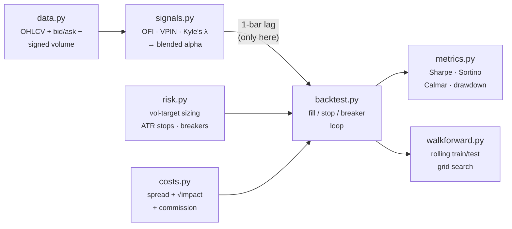

# quant_framework

**An institutional-grade backtesting engine for futures & FX microstructure strategies.**

Vol-target sizing · ATR trailing stops · circuit breakers · spread + market-impact + commission costs · walk-forward validation

`Python 3.10+` · `pandas` · `NumPy` · `zero look-ahead by construction`

</div>

---

> [!WARNING]
> **The example results in this README use synthetic data with a hand-planted signal.** The Sharpe ratios you'll see (20–50+) are *not* realistic and should not be read as "this strategy works." The synthetic generator embeds a detectable order-flow impulse directly into both price and signed volume so the demo has something to detect — real markets are far more adversarial. This project exists to prove the **engine** is correct (no look-ahead, costs deducted per fill, stops/breakers fire, out-of-sample data stays out-of-sample), not to sell you an edge. Swap in real tick/quote data via `load_ohlcv_csv()` before drawing any conclusion about alpha. See [Honest limitations](#honest-limitations).

---

## Why this exists

Most backtests fail for one of three boring reasons: they peek at the future, they ignore what it actually costs to trade, or they get "optimized" until the in-sample Sharpe looks great and the out-of-sample Sharpe doesn't exist. This framework is built so those three failure modes are structurally hard to reach:

- **Look-ahead is centralized.** The alpha signal is lagged by exactly one bar in exactly one place ([`backtest.py`](quant_framework/backtest.py)) — not scattered across every signal function where it's easy to get wrong.
- **Costs are not a fudge factor.** Every fill pays half-spread + square-root market impact + commission, sized off the *actual* order, not the gross position.
- **Optimization is walk-forward by default.** Parameters are grid-searched in-sample and scored strictly out-of-sample on the next window. The number you're allowed to trust is the concatenation of OOS segments only.

## Table of contents

- [Architecture](#architecture)
- [Quick start](#quick-start)
- [Module reference](#module-reference)
- [The microstructure signal](#the-microstructure-signal)
- [Cost model](#cost-model)
- [Risk management](#risk-management)
- [Walk-forward validation](#walk-forward-validation)
- [Example results](#example-results)
- [Using real data](#using-real-data)
- [Repo structure](#repo-structure)
- [Honest limitations](#honest-limitations)
- [License](#license)

## Architecture



Data flows one direction. Signal generation and risk management are fully decoupled — swap either without touching the other.

## Quick start

```bash
git clone microstructure-backtest-engine
/
cd quant_framework
pip install pandas numpy

python3 run_example.py
```

This generates synthetic ES futures data, builds the microstructure alpha, runs a naive backtest and a risk-managed backtest side by side, and finishes with a walk-forward validation pass. Expect ~15–30 seconds on a laptop.

```python
from quant_framework import (
    generate_synthetic_futures_data, INSTRUMENTS,
    Backtester, SizingParams, StopParams, CircuitBreakerParams,
    combined_alpha,
)

spec = INSTRUMENTS["ES"]
market = generate_synthetic_futures_data(n_bars=15_000, bar_seconds=30, instrument="ES")
alpha = combined_alpha(market, ofi_lookback=20, vpin_lookback=50)["alpha"]

bt = Backtester(
    spec,
    sizing_params=SizingParams(target_annual_vol=0.10, capital=1_000_000.0),
    stop_params=StopParams(atr_lookback=20, atr_multiple=2.5),
    breaker_params=CircuitBreakerParams(daily_loss_limit_pct=0.02, max_drawdown_limit_pct=0.10),
)
result = bt.run(market, alpha, entry_threshold=0.15)
print(result.report)
```

## Module reference

| Module | Responsibility |
|---|---|
| [`data.py`](quant_framework/data.py) | `MarketData` schema, synthetic futures generator, real-data CSV/parquet loader |
| [`signals.py`](quant_framework/signals.py) | Order Flow Imbalance, VPIN proxy, Kyle's λ, blended tradeable alpha |
| [`costs.py`](quant_framework/costs.py) | Half-spread + square-root market impact + commission, per fill |
| [`risk.py`](quant_framework/risk.py) | Inverse-vol position sizing, ratcheting ATR trailing stop, circuit breakers |
| [`backtest.py`](quant_framework/backtest.py) | The engine — signal lag, fills, stops, breakers, equity path |
| [`metrics.py`](quant_framework/metrics.py) | Sharpe, Sortino, Calmar, drawdown, turnover, hit rate, cost attribution |
| [`walkforward.py`](quant_framework/walkforward.py) | Rolling train/test parameter search with strict OOS scoring |

## The microstructure signal

Three signals, blended into one continuous alpha in `[-1, 1]`:

- **Order Flow Imbalance (OFI)** — rolling sum of signed volume over rolling volume. The workhorse short-horizon buy/sell pressure signal.
- **VPIN proxy** — a rolling-window analogue of the Easley/López de Prado Volume-Synchronized Probability of Informed Trading. High VPIN = flow is unusually one-sided = elevated odds of informed trading.
- **Kyle's λ** — rolling regression slope of price change on signed order flow. Estimates current price-impact-per-unit-flow (i.e. how thin the liquidity is right now).

VPIN is magnitude-only, so it's signed by the concurrent OFI direction before the two are z-scored and blended with `tanh` squashing. All three are strictly causal as of each bar's close — the 1-bar lag happens once, downstream, in the backtest engine.

## Cost model

Standard institutional TCA, three additive components, all in `costs.py`:

1. **Spread** — half the quoted bid/ask spread, paid on every fill.
2. **Market impact** — Almgren-Chriss-style square-root model: `impact ∝ σ · √(participation_rate)`. Grows sub-linearly with size but accelerates with volatility and with your share of bar volume. Participation is capped as a risk control.
3. **Commission** — fixed $ per contract/lot.

There's no separate "slippage" line — it emerges from spread + impact, which is harder to fudge than an arbitrary bps haircut.

## Risk management

- **`VolTargetSizer`** — inverse-volatility position sizing so every open position contributes roughly the same ex-ante dollar risk, regardless of the current volatility regime.
- **`ATRTrailingStop`** — a ratcheting stop (only ever tightens in the trade's favor), checked against intrabar high/low so it isn't fooled by looking at the close.
- **`CircuitBreaker`** — three independent kill switches: a daily loss limit, a rolling max-drawdown de-lever, and a volatility-spike pause on new entries. All computed off equity *through the prior bar only*.

## Walk-forward validation

```mermaid
gantt
    dateFormat X
    axisFormat %s
    section Window 0
    Train (grid search) :0, 4000
    Test (OOS, scored once) :4000, 5500
    section Window 1
    Train (grid search) :1500, 5500
    Test (OOS, scored once) :5500, 7000
```



Each window trains on a slice, grid-searches signal parameters for the best net-of-cost Sharpe, then evaluates *only that winning configuration* on the next slice — which the parameter search never saw. The final trustworthy number is the Sharpe of the concatenated OOS segments, not any individual window's in-sample number.

## Example results

Synthetic ES futures, 30-second bars, 15,000 bars (~1 week RTH-equivalent), $1M capital. **Remember the warning at the top of this document — these numbers are inflated by design.**

| Metric | Naive engine | Risk-managed engine |
|---|---:|---:|
| Sharpe | −11.92 | 27.21 |
| Sortino | −13.04 | 40.76 |
| Max Drawdown | −12.78% | −0.47% |
| Ann. Return | −77.4% | +510.9% |
| Gross P&L | −$14,533 | $243,212 |
| Total Costs | $93,208 | $95,309 |
| **Net P&L** | **−$107,741** | **$147,902** |
| Cost Drag | −641% | 39.2% |

Cost attribution (risk-managed engine): **$66,883** spread · **$8,294** impact · **$20,133** commission.

Walk-forward, concatenated out-of-sample Sharpe: **41.77** (again — synthetic, inflated; see warning above).

The naive engine isn't a strawman built to lose — it's fixed position size, no stop-loss, and spread-only costs, which is what a lot of first-pass backtests look like. The point of the comparison is the *delta*, not either number in isolation.

A full visual tear sheet (equity curves, drawdown, cost waterfall, walk-forward chart) is generated by [`export_results.py`](quant_framework/export_results.py).

## Using real data

```python
from quant_framework import load_ohlcv_csv

market = load_ohlcv_csv("path/to/your/data.csv")
# Required columns: timestamp, open, high, low, close, volume
# Optional: bid, ask (estimated from range if absent)
#           signed_volume (estimated via tick rule if absent — weaker
#           than real quote/trade data; replace with venue data when you can)
```

Everything downstream — signals, costs, risk, backtest, walk-forward — works unchanged once your data matches the schema.

## Repo structure

```
quant_framework/
├── __init__.py        # public API
├── data.py             # data layer + synthetic generator
├── signals.py           # OFI / VPIN / Kyle's λ / blended alpha
├── costs.py              # transaction cost model
├── risk.py                # sizing, stops, circuit breakers
├── backtest.py             # the engine
├── metrics.py               # performance reporting
├── walkforward.py            # rolling optimization
├── run_example.py             # end-to-end demo script
└── export_results.py           # dumps results.json for the HTML tear sheet
```

## Honest limitations

- The synthetic data generator plants a detectable signal on purpose — do not benchmark real strategies against these numbers.
- VPIN here is a rolling-window analogue, not true equal-volume bucketing — a reasonable trade-off for index alignment, not a research-grade VPIN implementation.
- Without real Level 2 data, `signed_volume` from a CSV falls back to the tick rule, which is a weaker proxy than actual quote/trade classification.
- The backtest engine assumes fills at bar-open with no partial fills or queue position — fine for the sizes this framework targets (see `max_participation_rate`), not fine for anything approaching a meaningful fraction of displayed size.
- This is a research/backtesting tool, not an execution system. Nothing here talks to a broker or exchange.

## License
MIT License
